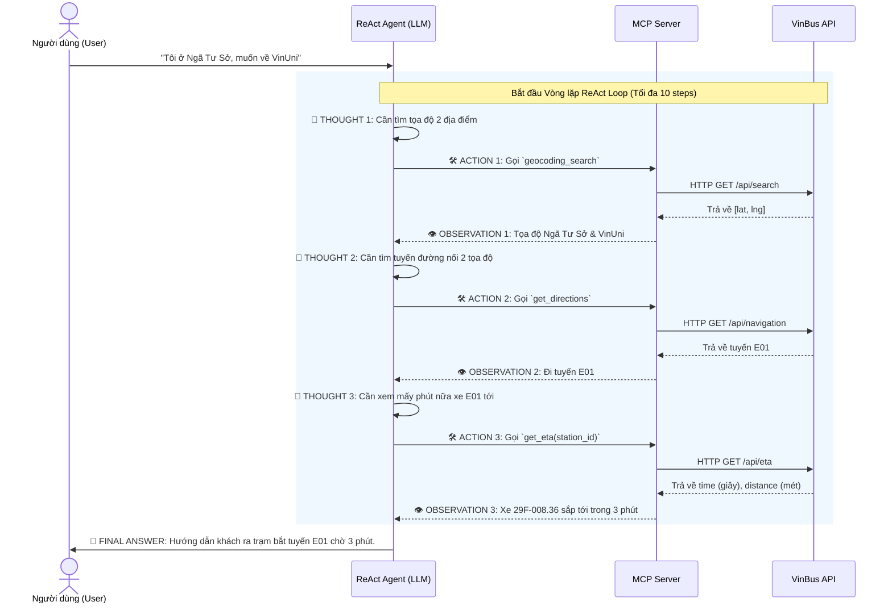

# 🚀 KỊCH BẢN TRÌNH BÀY DEMO DAY 3: TRỢ LÝ THÔNG MINH VINBUS

## 1. Đề tài lựa chọn & Lý do chọn đề tài
- **Đề tài:** Xây dựng Trợ lý Thông minh VinBus (VinBus ReAct Agent).
- **Lý do lựa chọn:** 
  - Giao thông công cộng (đặc biệt là xe buýt điện) là phương tiện di chuyển phổ biến, nhưng lịch trình thường bị ảnh hưởng bởi tắc đường, thời tiết.
  - Các Chatbot tĩnh (như dùng RAG hay Prompt thường) **không thể** trả lời được câu hỏi "Bao giờ xe tới?" vì dữ liệu thay đổi theo từng giây.
  - Cần một AI Agent có khả năng chủ động tương tác với thế giới thực (gọi trực tiếp vào hệ thống API nội bộ của VinBus) để lấy dữ liệu sống (Live Data) và tư vấn lộ trình như một điều phối viên thực thụ.

---

## 2. Tại sao ReAct Agent Pattern lại phù hợp? (4 Tiêu chí Agent Fit)
Kiến trúc **ReAct (Reasoning + Acting)** là hoàn hảo cho bài toán này dựa trên 4 tiêu chí cốt lõi:
1. **Multi-step Reasoning (Suy luận đa bước):** Để trả lời câu hỏi *"Tôi đang ở Ngã Tư Sở, muốn về Ocean Park"*, Agent phải tự suy luận ra các bước: Tìm tọa độ 2 điểm ➔ Tìm tuyến đường nối 2 điểm ➔ Tìm trạm gần nhất ➔ Tính giờ xe sắp tới trạm đó.
2. **Tool Interaction (Tương tác công cụ):** Agent bắt buộc phải sử dụng công cụ (Tools) để gọi ra ngoài Internet, giao tiếp với backend của Vinbus (Navigation API, ETA API, Geocoding API).
3. **Dynamic Decision (Ra quyết định động):** Luồng tư duy của Agent sẽ rẽ nhánh linh hoạt dựa vào kết quả API. Ví dụ: Nếu `get_eta` báo xe còn 20 phút mới tới, Agent khuyên khách thong thả; nếu xe chỉ còn 30 giây, Agent lập tức giục khách chạy ra bến.
4. **Long Horizon Goal (Mục tiêu dài hạn):** Duy trì bối cảnh (Chat History) qua nhiều lượt hội thoại để hỗ trợ hành khách từ lúc lên kế hoạch đi lại cho đến khi bước chân lên đúng chiếc xe buýt.

---

## 3. Workflow Kiến trúc Hệ thống
Dưới đây là luồng thực thi (Thought - Action - Observation) khi Agent giải quyết một truy vấn của người dùng, giao tiếp qua **MCP Server (Model Context Protocol)**.



---

## 4. Bộ Công cụ (Tools) đã xây dựng
Hệ thống cung cấp cho Agent 5 công cụ đắc lực thông qua chuẩn MCP:

| Tên Tool | Chức năng & Công dụng |
| :--- | :--- |
| 📍 `geocoding_search` | Nhận đầu vào là tên địa danh/địa chỉ dạng Text. Trả về tọa độ kinh độ, vĩ độ (`lat`, `lng`). Dùng để hiểu vị trí của user. |
| 🗺️ `get_directions` | Nhận tọa độ Điểm A và Điểm B. Trả về danh sách các lộ trình (hướng dẫn bắt tuyến nào, trạm nào, qua bao nhiêu điểm dừng). |
| 🚏 `get_near_stations` | Nhận tọa độ và bán kính. Trả về danh sách các trạm xe buýt quanh vị trí người dùng đang đứng. |
| ℹ️ `get_station_detail` | Lấy danh sách tĩnh các tuyến xe chạy qua một trạm cụ thể (Tên tuyến, Tần suất, Giờ hoạt động). |
| ⏱️ `get_eta` | **Công cụ quan trọng nhất.** Lấy dữ liệu Thời gian thực (Real-time). Báo chính xác biển số xe sắp tới, khoảng cách mét và số giây đếm ngược. |

---

## 5. Hướng dẫn chạy Demo UI
Để phần trình bày trực quan và dễ theo dõi trace log từng bước của LLM, dự án đã tích hợp giao diện **Streamlit**.

**Cách cài đặt và chạy:**
```bash
# 1. Cài đặt Streamlit
pip install streamlit

# 2. Khởi chạy giao diện Demo
streamlit run demo_ui.py
```
*(Thử nghiệm gõ: "Tôi đang ở Times City, bao giờ có xe E01 đi qua?")*

---
## 6. Kịch bản Demo Live (Sao chép & Dán)

**Kịch bản 1: Hỏi đáp bối cảnh (Memory)**
* **User (Lượt 1):** `Chào bạn, tôi là Tân Sinh Viên, đang đứng ở Ngã Tư Sở.`
* **Agent:** Chào bạn! Bạn đang đứng ở Ngã Tư Sở. Bạn muốn đi đâu để mình tìm xe buýt giúp?
* **User (Lượt 2):** `Bạn nhớ tôi vừa bảo tôi đứng ở đâu không?`
* **Agent:** Có chứ, bạn vừa cho biết bạn đang đứng ở Ngã Tư Sở.
*(Ý nghĩa: Phô diễn khả năng lưu trữ Context/History của mô hình).*

**Kịch bản 2: Tìm đường + ETA Thời gian thực (Multi-step Reasoning)**
* **User:** `Từ chỗ tôi (Ngã Tư Sở) muốn về Đại Học VinUni thì đi tuyến nào và bao giờ xe tới?`
* **Trace Log Dự Kiến (Sẽ show trên UI):**
  1. `geocoding_search`: Lấy toạ độ Ngã Tư Sở và VinUni.
  2. `get_directions`: Tìm lộ trình nối 2 điểm ➔ Trả về tuyến E01.
  3. `get_eta`: Lấy thời gian xe tới bến realtime.
* **Agent:** Sẽ hướng dẫn người dùng bắt tuyến E01, báo chính xác mã biển số xe và giục người dùng ra bến trong `X phút` nữa.
