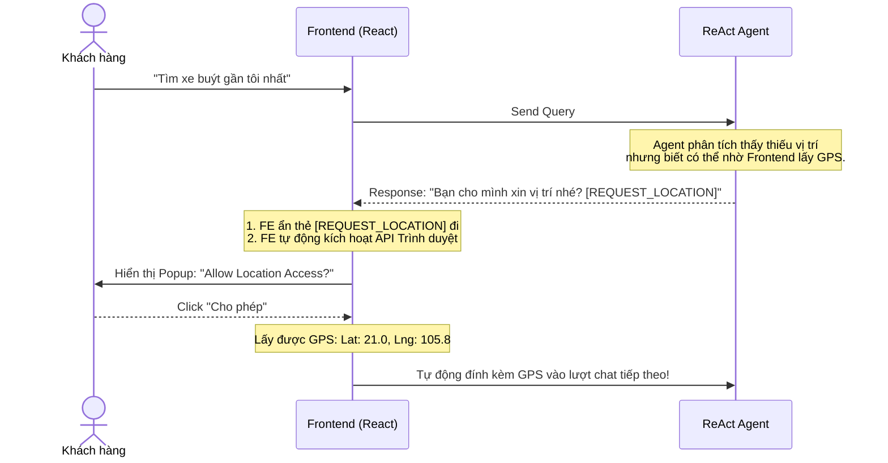
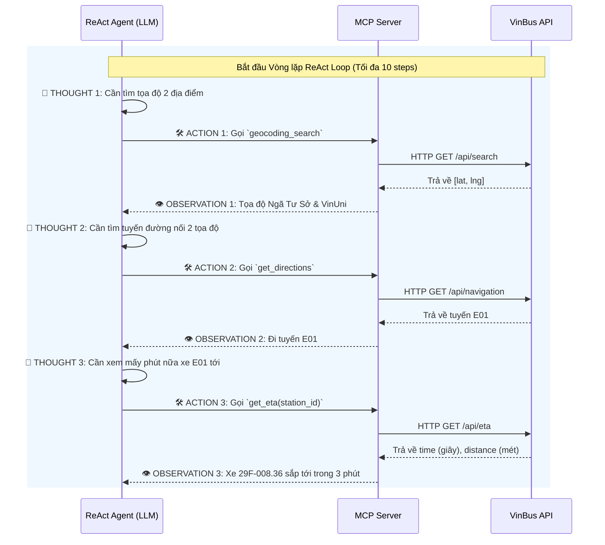

# 🚀 KỊCH BẢN TRÌNH BÀY DEMO DAY 3: TRỢ LÝ THÔNG MINH VINBUS

## 1. Đề tài lựa chọn & Lý do chọn đề tài
- **Đề tài:** Xây dựng Trợ lý Thông minh VinBus (VinBus ReAct Agent).
- **Lý do lựa chọn:** 
  - Giao thông công cộng (đặc biệt là xe buýt điện) là phương tiện di chuyển phổ biến, nhưng lịch trình thường bị ảnh hưởng bởi tắc đường, thời tiết.
  - Các Chatbot tĩnh (như dùng RAG hay Prompt thường) **không thể** trả lời được câu hỏi "Bao giờ xe tới?" vì dữ liệu thay đổi theo từng giây.
  - Cần một AI Agent có khả năng chủ động tương tác với thế giới thực (gọi trực tiếp vào hệ thống API nội bộ của VinBus) để lấy dữ liệu sống (Live Data) và tư vấn lộ trình như một điều phối viên thực thụ.

---

## 2. Tại sao ReAct Agent Pattern lại phù hợp? (4 Tiêu chí Agent Fit)
Kiến trúc **ReAct (Reasoning + Acting)** là hoàn hảo cho bài toán này dựa trên 4 tiêu chí cốt lõi:
1. **Multi-step Reasoning (Suy luận đa bước):** Để trả lời câu hỏi *"Tôi đang ở Ngã Tư Sở, muốn về Ocean Park"*, Agent phải tự suy luận ra các bước: Tìm tọa độ 2 điểm ➔ Tìm tuyến đường nối 2 điểm ➔ Tìm trạm gần nhất ➔ Tính giờ xe sắp tới trạm đó.
2. **Tool Interaction (Tương tác công cụ):** Agent bắt buộc phải sử dụng công cụ (Tools) để gọi ra ngoài Internet, giao tiếp với backend của Vinbus (Navigation API, ETA API, Geocoding API).
3. **Dynamic Decision (Ra quyết định động):** Luồng tư duy của Agent sẽ rẽ nhánh linh hoạt dựa vào kết quả API. Ví dụ: Nếu `get_eta` báo xe còn 20 phút mới tới, Agent khuyên khách thong thả; nếu xe chỉ còn 30 giây, Agent lập tức giục khách chạy ra bến.
4. **Long Horizon Goal (Mục tiêu dài hạn):** Duy trì bối cảnh (Chat History) qua nhiều lượt hội thoại để hỗ trợ hành khách từ lúc lên kế hoạch đi lại cho đến khi bước chân lên đúng chiếc xe buýt.

---

## 3. Các Biểu Đồ Workflow (Dành cho Thuyết Trình)

### Biểu đồ 1: Tổng quan Kiến trúc Hệ thống (System Architecture)
Biểu đồ này thể hiện cấu trúc Client-Server hiện đại của dự án, tách biệt giữa Giao diện người dùng (React) và Lõi AI (FastAPI + LLM).

```mermaid
flowchart LR
    A[Client UI \n(Vite + React)] <-->|REST API| B[Backend Server \n(Python FastAPI)]
    B <-->|Chat History & Prompt| C{ReAct Agent \n(Gemini/OpenAI)}
    C <-->|Tool Call| D[MCP Server \n(Python)]
    D <-->|HTTP| E[(VinBus API)]
    
    style A fill:#10b981,stroke:#047857,color:white
    style B fill:#3b82f6,stroke:#1d4ed8,color:white
    style C fill:#8b5cf6,stroke:#6d28d9,color:white
    style D fill:#f59e0b,stroke:#b45309,color:white
    style E fill:#ef4444,stroke:#b91c1c,color:white
```

### Biểu đồ 2: Luồng xử lý Tự động định vị GPS (Magic UX Flow)
Đây là tính năng độc quyền: AI Agent điều khiển UI của người dùng để xin quyền GPS mà không cần code logic phức tạp ở Backend.



### Biểu đồ 3: Luồng suy luận đa bước (ReAct Loop)
Biểu đồ thể hiện cách Agent làm việc để trả lời một câu hỏi phức tạp.



---

## 4. Bộ Công cụ (Tools) đã xây dựng
Hệ thống cung cấp cho Agent 5 công cụ đắc lực thông qua chuẩn MCP:

| Tên Tool | Chức năng & Công dụng |
| :--- | :--- |
| 📍 `geocoding_search` | Nhận đầu vào là tên địa danh/địa chỉ dạng Text. Trả về tọa độ kinh độ, vĩ độ (`lat`, `lng`). Dùng để hiểu vị trí của user. |
| 🗺️ `get_directions` | Nhận tọa độ Điểm A và Điểm B. Trả về danh sách các lộ trình (hướng dẫn bắt tuyến nào, trạm nào, qua bao nhiêu điểm dừng). |
| 🚏 `get_near_stations` | Nhận tọa độ và bán kính. Trả về danh sách các trạm xe buýt quanh vị trí người dùng đang đứng. |
| ℹ️ `get_station_detail` | Lấy danh sách tĩnh các tuyến xe chạy qua một trạm cụ thể (Tên tuyến, Tần suất, Giờ hoạt động). |
| ⏱️ `get_eta` | **Công cụ quan trọng nhất.** Lấy dữ liệu Thời gian thực (Real-time). Báo chính xác biển số xe sắp tới, khoảng cách mét và số giây đếm ngược. |

---

## 5. Hướng dẫn chạy Hệ thống để Demo
Hệ thống được thiết kế theo chuẩn Client-Server chuyên nghiệp. Chạy 2 lệnh sau ở 2 Terminal riêng biệt:

**1. Khởi động Backend AI (Terminal 1)**
```bash
pip install fastapi uvicorn
python api.py
```

**2. Khởi động Frontend Trợ lý (Terminal 2)**
```bash
cd frontend
npm install
npm run dev
```
*(Mở trình duyệt tại `http://localhost:5173` để thao tác với giao diện Client siêu đẹp)*

---
## 6. Kịch bản Demo Live (Sao chép & Dán)

**Kịch bản 1: Phô diễn Luồng Tự Động Xin GPS (Killer Feature)**
* **User (Click nút Tắt GPS nếu đang bật):** `Cho tôi biết trạm xe buýt gần tôi nhất ở đâu?`
* **Agent:** Sẽ trả lời đại loại *"Bạn cho mình xin vị trí nhé"* ➔ **BÙM!** Trình duyệt văng ra cửa sổ hỏi quyền Location cực kỳ chuyên nghiệp.
* *(Sau khi Client cấp quyền GPS, hãy thử hỏi lại câu đó, hệ thống sẽ tự đọc tọa độ thực của Client và tìm trạm VinBus ngay sát vách!)*

**Kịch bản 2: Tìm đường + ETA Thời gian thực (Multi-step Reasoning)**
* **User:** `Từ Ngã Tư Sở muốn về Đại Học VinUni thì đi tuyến nào và bao giờ xe tới?`
* **Trace Log Dự Kiến (Sẽ show trên màn hình phải của UI):**
  1. `geocoding_search`: Lấy toạ độ Ngã Tư Sở và VinUni.
  2. `get_directions`: Tìm lộ trình nối 2 điểm ➔ Trả về tuyến E01.
  3. `get_eta`: Lấy thời gian xe tới bến realtime.
* **Agent:** Hướng dẫn người dùng bắt tuyến E01, báo chính xác mã biển số xe và thời gian xe tới (tự quy đổi từ giây sang phút).
